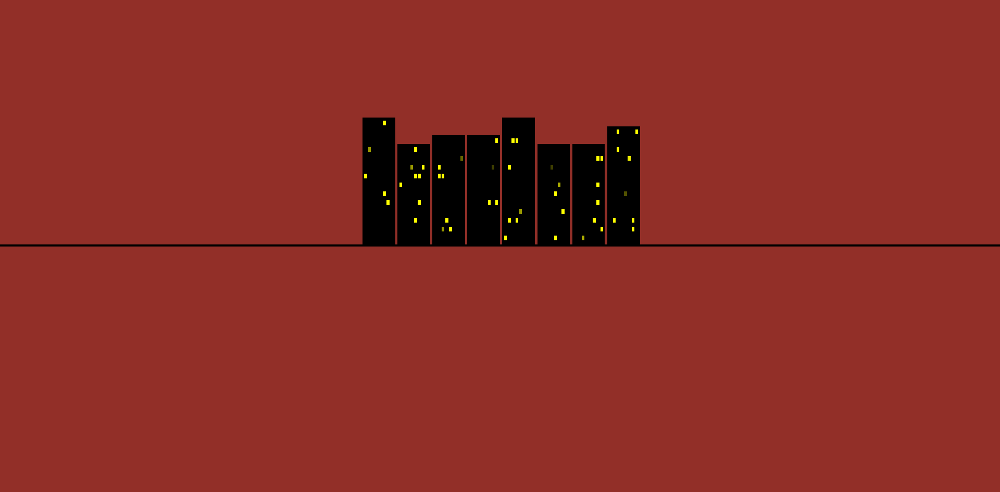
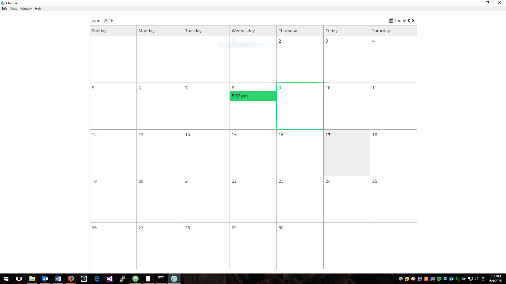
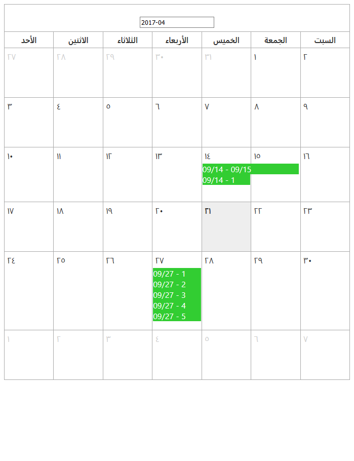

# C++ Game engine (~ September 2015)
* **Original Objective:** Create my own game engine.  Be as *low level* as I could.  I had very briefly attempted to learn assembly before this and so I wanted to interact with the OS API directly.
* **Technologies Used / Learned:**
	* Windows API to create the window and handle the event loop
	* C++
	* OpenGL
* **Results:** I blocked out a scene graph.  I also learned about how state changes in 

# Photography (~January 2016)
* **Technologies Used:**
	* JavaScript
	* HTML
	* Dynamicly loading and displaying images
		* First encountered that concurency is hard: I had a feature where the image would get brighter when you hovered over them and wouldn't switch out like the rest, but there was a concurency bug where the user could hover over an image while it was fading out to be replaced and the image would become bright and then switch.

# Chandler (~February 2016)
* Local Storage, JSON, first encountered the difficulty of dynamic typing...

# Mandelbrot Viewer (~March 2016)
Canvas; Build in one night right?

# CityThing (May 2016)

* **Technologies Used**:
	* HTML
	* CSS
	* JavaScript

# First Try Calendar (~June 2016)

Electon, React, raw JavaScript Date objects

# Dotty (August 2017)
* **Original Objective:** Build a program that could pixelate any image it was given.
* **Technologies Used:**
	* Object URLs to make the images downloadable
	* Multiple Canvases
## Dotty V1 (August 2017)
* Mostly like Dotty except that it used HTML elements (made into circles using border-radius) instead of drawing pixels into a canvas.  This meant that the images couldn't be saved and so I rewrote it to render to a canvas.

# Basic-Calendar (~September 2017)

Custom Element, Multi-Lingual, HTML Table based Layout
* **Technologies Used:**
	* DateTimeFormat
	* Custom Element (To change the language, you change the lang attribute on the element)

## Grid-Calendar (~September 2017)
Same as Basic-Calendar but with CSS Grid instead of HTML Table.  Didn't get very far before moving on toward Cascade.

# Cascade (July - August 2018)
State management.  Spent a lot of time drawing Directed Acyclic Graphs.  Learned that state management is actually a complicated problem.  "Push or Pull?"  I don't think that it's not solvable though.  I think that there must be some abstraction that doesn't lock you into using observables / mono-state / functional / whatever thing you've locked yourself into.  I think that state management should have a common abstraction and then the implementations should be swapped around through interactive optimization and then everything should be compiled away.

# Realtime processing (~December 2018)
* **Technologies Used:**
	* Rust
	* JavaScript
	* Canvas
	* User Media API
	* Web Assembly
	* Web Workers
	* Transfereable ArrayBuffers between workers and main thread

# Courtyard Clue (~February 2019)

# Courtyard Clue using async generators (~February 2019)

# JS-Min (March 2019 - January 2020)

# Courtyard Clue using js-min (~May 2019)

# Translators Assignments: Rust (May - June 2019)

# Calendar using js-min (August - November 2019)

# Computer Graphics assignments (October - December 2019)

# Sudoku (December 2019)

# Sudoku js-min (Decementer 2019)

# Web 3.0 test (~January 2020)

# Copy and pasted the RPI bare metal examples?

# Android App development Homework

# WASM-SYM

# Physics VR website

# Simon Says Memory Game: FPGA

# AVR Assembly Class

# Web Development Stuff: Full stack recipe thing right?
* Content Editable

# Free Code Camp: Game of Life, Recipe Box, Quote machine, Tribute Page, 

# Pens: WebAudio Synth, Snow Bookmarklets, 

# Databases Homework

# The walking sombrero
Scratch

# PHP hacking simulation

# Wordpress themes

# Robotics Programs
* First attempt at parallel processing that didn't go well: Let main task end
* Dead reconning (timing based) autonomous program in the car ride to the competition